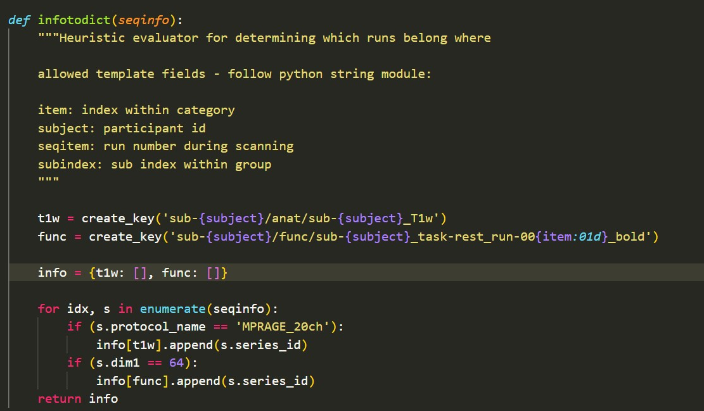

# BIDS-Conversion

My data set consists of Dicoms, which are not arragend according to the 'Brain Imaging Data Structure' (BIDS). But why is this not [practical](./BIDS-Conversion.md#brain-imaging-data-structure) and how can one [convert](./BIDS-Conversion.md#dicom-conversion) the data structure into the BIDS format?

This is something I will explain in the following. Let's begin with BIDS and the advantages of organising data like that.

## Brain Imaging Data Structure

BIDS is a standard developed to get to a consensus on how to organize, describe and collect neuroimaging data. BIDS is based on NiFTi files, which should be converted from source dat e.g. DICOM. BIDS follows a specific way on naming and structuring files as you can see in the image below.[^1] Next to the NiFTi files, which stores the brain imaging data [^2], JSON files containing the respective metadata and TSV files with demographics etc. 


*taken from Gorgolewski, K., Auer, T., Calhoun, V. et al. (2016), p.3*

### Advantages
 
Using a common standard for the description and organization has the follwoing advantages[^3] :

* easily understandable data structure, so that veryone at any time can work with the data
* reduces error due to misunderstandings
* optimizing reproducability and efficiency, as standardization allows automated analysis workflows
* validation tools make finding missings easier
* speeds up sharing data on online databases as they can understand and export data in BIDS format


## DICOM Conversion

Before starting to convert the data, one should organize anstructure the imaging data with at least a folder for each subject. If you have multiple session, the subject folder should have folders for each session. A folder for the NiFTis you will create is also a good idea.
For me the structure in the Data folder looked like this:

```
Data
└───Dicoms
    └───sub-01
    │   └───Anat
            └───SCANS
                └───DICOMS
    │   └───Run01
            └───SCANS
                └───DICOMS
    │   └───Run02
            └───SCANS
                └───DICOMS
    │   └───Run03
            └───SCANS
                └───DICOMS
    │   └───Run04
            └───SCANS
                └───DICOMS
    │   └───Loc
    │   └───Trails
    └───sub-02
└───NiFTi
```

There are a number of converters out there, but I used HeuDiConv and in the following I will explain the neccessary steps my data went through to convert it. I only will need th anatomical and the funtional scans from the runs.

### HeuDiConv
HeuDiConv is a flexible DICOM converter for organizing your brain imaging data into a directory layout depending on your needs as you can simple adapt the heuristic. It provides a fast way of transforming your data as it only uses the relevant DICOMS [^4] and dcm2niix, which converts Dicoms into NiFTi files[^5]. To make life a bit more easy, there are some tutorials out there from which I followed the [walkthrough](https://reproducibility.stanford.edu/bids-tutorial-series-part-2a/) by the Stanford Center for Reproducible Neuroscience.

#### Requirements
* [Docker Desktop](https://docs.docker.com/desktop/windows/wsl/)
* Ubuntu 20.04 LTS or any latest version or WSL
* Conda 4.12.0 or latest version
* [VS Code](https://code.visualstudio.com/)

(bring this to life was a hugh mess for me, [see](./Discussion.md#difficulties-and-throwbacks))

#### Process
1. **setting up the environment:**
    After installing everything, you need to enable your WSL in Docker and now you have to pll the latest release of heudiconv.

        ```
        $ docker pull nipy/heudiconv:latest
        ```
2. **getting the dicominfo file:**
    Now you run heudiconv the first time on the first subject to receive the dicominfo file, which is needed to edited the heuristic.py according to the experiment.

        ```
        $ docker run --rm -it -v /mnt/d/Data:/base nipy/heudiconv:latest -d /base/Dicoms/sub-{subject}/*/*/*/* -o /base/NiFTi/ -f convertall -s 01 -c none --overwrite
        ```
    `docker run --rm`: calls docker

    `-v /mnt/d/Data:/base`:  mouths the path to my data and calls it bas

    `nipy/heudiconv:latest`: calls latest heudiconv

    `-d`:  is the path to my Dicom files, with the `/*/*/*/*` defining that they can be found 4 folders deep in the file structure

    `-o`: dfines my output folder

    `-f`: stands for the heuristic file, which will be used later to convert all other files

    `-s 01`: will step in for the place holder in `-d`

    `-c`: converter that is used, here none

    After running this command there is a hidden file in the NiFTi folder, from which you need to move the dicominfo.tsv into the NiFTi folder

    ```
    $ cp /mnt/d/Data/NiFTi/.heudiconv/01/info/dicominfo.tsv /mnt/d/Data
    ```
3. **editing the heuristic.py:**

    So there is the discominfo.tsv which contains a lot of inforamtion on the fMRI measurement. For this case I recieved the follwoing variables:

        - total_files_till_now	
        - example_dcm_file	
        - series_id	dcm_dir_name	
        - series_files	
        - unspecified	
        - dim1	
        - dim2	
        - dim3	
        - dim4	
        - TR	
        - TE	
        - protocol_name	
        - is_motion_corrected	
        - is_derived	
        - patient_id	
        - study_description	
        - referring_physician_name	
        - series_description	
        - sequence_name	
        - image_type	
        - accession_number	
        - patient_age	
        - patient_sex	
        - date	
        - series_uid	
        - time

    With that information you adapt the heuristic file with VS Code, which is in the hidden folder. Here you can see my edited heuristic:

    

    `t1w = create_key('sub-{subject}/anat/sub-{subject}_T1w'` and `func = create_key('sub-{subject}/func/sub-{subject}_task-rest_run-00{item:01d}_bold')` define the conversion outputs for the anatomical and functional scans and contain the naming convetion for the NiFTI files. 

    <details>
    <summary>T1w and T2w</summary>
    <p>T1w: repetition time (TR) and the echo time (TE) are selected in such a way that the examined tissues are mainly determined by their T1 relaxation time, resulting in images where bones and other high-fat structures are light[^6]

    T2w:the repetition time (TR) and the echo time (TE) are chosen in such a way that the examined tissues are differentiated primarily by their T2 relaxation time, what results in images where fluids are light[^7] </p>
    </details>

    In `for idx, s in enumerate(seqinfo)` you define according to the Dicom metadata which file should be assigned to which key. Here the dicominfo.tsv comes into play. I decided that in order to get assigned to  `t1w` the `protocol name` hast to be `MPRAGE_20ch` in the files, as that is specific for the anatomical scans. To get assigned to `func` I decided that the `dim1` has to be `64`, as that was specific for the funktional runs.

4. **Converting all:**

    After changing the heuristic.py the conversion party can begin with the follow command:

    ```
     docker run --rm -it -v /mnt/d/Data:/base nipy/heudiconv:latest -d /base/Dicoms/sub-{subject}/*/*/*/* -o /base/NiFTi/ -f /base/NiFTi/code/heuristic.py -s 01 02 03 04 05 06 07 08 09 10 11 12 13 14 15 16 17 18 19 20 21 22 23 24 25 26 27 28 29 30 -c dcm2niix -b --overwrite
    ```
    It ist similar to the one used before, but with some important changes:

    `-f`: the path to the heuristic file

    `-s`: is a list and now all subjects will be converted

    `-c`: the converter dcm2niix is added to transform the dicoms into NiFTis

    `-b`: flags that output shall be converted into BIDS

With that being done, it is almost ready. One last step is to validate the data set to make sure it is now in the BIDS format and nothing is missing. Which can be easily done with http://bids-standard.github.io/bids-validator/ or withe setup we already needed, you can do the following command:

```
docker run -ti --rm -v /mnt/d/Data/NiFTi:/data:ro bids/validator /data
```


*put Image here for validation*


# References

[^1]: Gorgolewski, K., Auer, T., Calhoun, V. et al. The brain imaging data structure, a format for organizing and describing outputs of neuroimaging experiments. Sci Data 3, 160044 (2016). https://doi.org/10.1038/sdata.2016.44S

[^2]: https://nifti.nimh.nih.gov/

[^3]: https://bids.neuroimaging.io/benefits.html#benefits

[^4]:Halchenko, Y., Goncalves, M., Velasco, P., Castello, M. V. di O., Ghosh, S., Salo, T., Hanke, M., II, J. T. W., Michael, Dae, Kent, J., Christian, H., Brett, M., Amlien, I., Gorgolewski, C., Lukas, D. C., Markiewicz, C., Tilley, S., Stadler, J., … Wagner, A. (2023). nipy/heudiconv: V0.12.0 (v0.12.0). Zenodo. https://doi.org/10.5281/zenodo.7662350

[^5]: Li, X., Morgan, P. S., Ashburner, J., Smith, J., & Rorden, C. (2016). The first step for neuroimaging data analysis: DICOM to NIfTI conversion. Journal of neuroscience methods, 264, 47–56. https://doi.org/10.1016/j.jneumeth.2016.03.001

[^6]: https://flexikon.doccheck.com/de/T1-Wichtung

[^7]: https://flexikon.doccheck.com/de/T2-Wichtung
